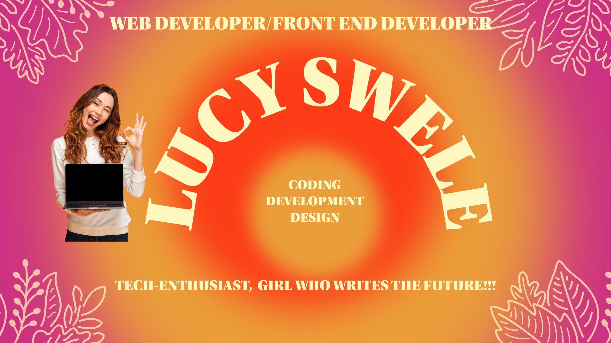

### LUCY VEROTIA SWELE

  **`Website Craftwoman (Developer/Tech-Enthusiast)`**
 
 Junior Software Developer with great Front End background diving into the world of Python and its frameowrks. Passionate about creating engaging user experiences. Excitied to blend front end skills in Python. Currently interning as a Software Developer at a construction company, open to other developer job roles that offer payment. 

### 🧰 Languages and Tools

  
 

- 🔭 <strong>I’m currently working on:</strong>
   Diving into the world of Python, Flask, Django, and Docker. Armed with curiosity and determination, with the aim to navigate the intricacies of these powerful tools, learning to build web applications and depoly them with efficiency. 
  
-  💻<strong>I’m looking to collaborate:</strong>
  I am looking to collaborate with anyone to enhance my skillset, gain knowledge and network for future job roles.
- 📫 <strong>How to reach me:</strong>
☎0614321528, 📩swelelucy97@icloud.com, 🖇Linkedin: Lucy Verotia Swele
-  💬<strong>About Me:</strong>
I am a dedicated tech learner with a background in Psychology and English, however, my passion has shifted towards being a Front-End Developer. Emabarking on this journey to purse my new career path of being a front-end developer. My transition is a reflection of creativity and hunger for problem-solving. It has been a exciting venture into the world of development. I can adapt to change and commitment are my core foundation to evolve in this field.
- ⚡ <strong>Fun fact:</strong>
My name means as of light, but I don't use lightmode because I don't want to attract bugs. Things aren't always #000000 and #FFFFFF.
-->
   
 
